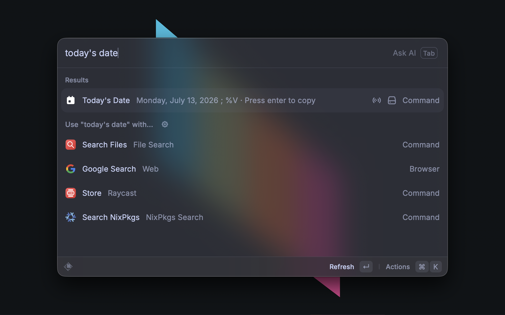

# Today's Date

A Raycast [no-view command](https://developers.raycast.com/information/lifecycle/commands#no-view-commands) that shows the current date and time as a live subtitle on Raycast's root search, styled like the built-in "Currently Playing Track" command. Pressing enter copies the formatted value to your clipboard.

The subtitle refreshes every minute in the background.

## Preferences

| Preference | Type | Default | Description |
|---|---|---|---|
| Timezone Format | dropdown | IANA Timezone | Chooses whether the date is rendered using an IANA timezone name or a fixed UTC offset. Selects which of the two preferences below is used. |
| IANA Timezone | dropdown | `Europe/London` | Any IANA zone (e.g. `America/Chicago`, `Asia/Tokyo`). Handles DST automatically. Used when Timezone Format is "IANA Timezone". |
| UTC Offset | dropdown | `UTC+0` | Fixed offset from `UTC-12` through `UTC+14` in whole-hour steps. Used when Timezone Format is "UTC Offset". For `:30` or `:45` zones (India, Nepal, Newfoundland), pick an IANA timezone instead. |
| Date Format | textfield | `%A, %B %d, %Y` | strftime format string used to render the date. |

## Format string

The `Date Format` preference is a strftime template. Supported directives:

| Directive | Meaning | Example |
|---|---|---|
| `%Y` | Year, 4 digits | `2026` |
| `%y` | Year, 2 digits | `26` |
| `%m` / `%-m` | Month, zero-padded / unpadded | `07` / `7` |
| `%B` / `%b` | Month name, full / abbreviated | `July` / `Jul` |
| `%d` / `%-d` | Day of month, zero-padded / unpadded | `04` / `4` |
| `%A` / `%a` | Weekday, full / abbreviated | `Friday` / `Fri` |
| `%H` / `%-H` | Hour (24h), zero-padded / unpadded | `09` / `9` |
| `%I` / `%-I` | Hour (12h), zero-padded / unpadded | `09` / `9` |
| `%M` / `%-M` | Minute, zero-padded / unpadded | `05` / `5` |
| `%S` / `%-S` | Second, zero-padded / unpadded | `07` / `7` |
| `%p` | AM/PM | `PM` |
| `%%` | Literal `%` | `%` |

### Example formats

| Format string | Output |
|---|---|
| `%A, %B %d, %Y` | `Friday, July 10, 2026` |
| `%Y-%m-%d` | `2026-07-10` |
| `%Y-%m-%d %H:%M` | `2026-07-10 14:32` |
| `%-I:%M %p` | `2:32 PM` |
| `%a %b %-d` | `Fri Jul 10` |
